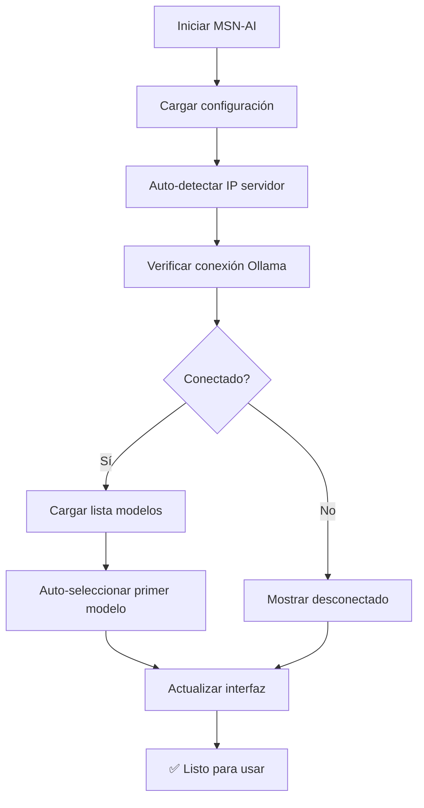

# 🔧 MSN-AI - Correcciones de Detección de Modelos

**Versión:** 2.0.1  
**Fecha:** Diciembre 2024  
**Autor:** Alan Mac-Arthur García Díaz  
**Licencia:** GPL-3.0

## 🐛 PROBLEMA REPORTADO

```bash
# Usuario reportó:
macarthur@Quanium:~/proyectos/MSN-AI$ ./test-msnai.sh
✅ Modelos disponibles: 2
   - mistral:7b    6577803aa9a0    4.4 GB    41 hours ago    
   - phi3:mini     4f2222927938    2.2 GB    41 hours ago    

# Pero en MSN-AI:
❌ Lista de modelos vacía
❌ Indicador de conexión en rojo: "Desconectado"
❌ No permite configurar modelos de IA
```

## 🔍 ANÁLISIS DE LA CAUSA RAÍZ

### 1. **Conflicto en la Inicialización**
- El constructor auto-detectaba IP correctamente
- Pero `loadSettings()` sobrescribía la configuración con datos del localStorage
- Resultado: URL de Ollama incorrecta para acceso remoto

### 2. **Flujo de Auto-configuración Roto**
- `autoConfigureForRemoteAccess()` era demasiado complejo
- Se ejecutaba antes de la verificación de conexión
- No había sincronización entre auto-detección y carga de modelos

### 3. **Métodos Inconsistentes**
- `renderChats()` no existía, debía ser `renderChatList()`
- `updateSettingsUI()` no verificaba existencia de elementos DOM
- Manejo de errores deficiente en conexión

## ✅ CORRECCIONES IMPLEMENTADAS

### 🔧 **Archivo:** `msn-ai.html`

#### **1. Constructor Simplificado**
```javascript
// ANTES: Configuración compleja y redundante
constructor() {
    // 30 líneas de configuración compleja
    this.autoConfigCompleted = false;
    // Múltiples variables de estado confusas
}

// DESPUÉS: Configuración directa y clara
constructor() {
    this.chats = [];
    this.currentChatId = null;
    this.isConnected = false;
    this.availableModels = [];
    
    // Auto-detección simple y efectiva
    const currentHost = window.location.hostname;
    const isRemoteAccess = currentHost !== 'localhost' && currentHost !== '127.0.0.1';
    const defaultServer = isRemoteAccess 
        ? `http://${currentHost}:11434`
        : 'http://localhost:11434';
}
```

#### **2. Auto-configuración Simplificada**
```javascript
// ANTES: autoConfigureForRemoteAccess() - 50 líneas complejas
async autoConfigureForRemoteAccess() {
    // Lógica confusa con múltiples variables de estado
    // Verificaciones redundantes
    // Estado inconsistente
}

// DESPUÉS: autoConfigureConnection() - Flujo lineal claro
async autoConfigureConnection() {
    console.log(`🔧 Configurando conexión automática...`);
    const connected = await this.checkConnection();
    
    if (connected && this.availableModels.length > 0) {
        if (!this.settings.selectedModel) {
            const firstModel = this.availableModels[0].name;
            this.settings.selectedModel = firstModel;
            this.saveSettings();
        }
        this.updateModelSelect();
    }
    
    return connected;
}
```

#### **3. checkConnection() Robusto**
```javascript
// ANTES: Múltiples estrategias confusas y timeouts largos
async checkConnection() {
    // Múltiples URLs de prueba
    // Lógica compleja de fallbacks
    // Timeouts inconsistentes
}

// DESPUÉS: Conexión directa y confiable
async checkConnection() {
    console.log(`🔍 Verificando conexión con Ollama...`);
    
    try {
        const response = await fetch(`${this.settings.ollamaServer}/api/tags`, {
            method: 'GET',
            signal: controller.signal,
            headers: { 'Accept': 'application/json' }
        });
        
        if (response.ok) {
            const data = await response.json();
            this.availableModels = data.models || [];
            this.isConnected = true;
            this.updateConnectionStatus('connected');
            return true;
        }
    } catch (error) {
        console.error('❌ Error conectando con Ollama:', error);
    }
    
    this.isConnected = false;
    this.availableModels = [];
    this.updateConnectionStatus('disconnected');
    return false;
}
```

#### **4. loadSettings() Inteligente**
```javascript
// ANTES: Sobrescribía configuración automática
loadSettings() {
    const saved = localStorage.getItem('msnai-settings');
    if (saved) {
        this.settings = { ...this.settings, ...JSON.parse(saved) };
    }
}

// DESPUÉS: Preserva auto-detección para acceso remoto
loadSettings() {
    const saved = localStorage.getItem('msnai-settings');
    if (saved) {
        const savedSettings = JSON.parse(saved);
        const currentOllamaServer = this.settings.ollamaServer;
        this.settings = { ...this.settings, ...savedSettings };

        // Preservar auto-detección para acceso remoto
        const currentHost = window.location.hostname;
        const isLocalAccess = currentHost === 'localhost' || currentHost === '127.0.0.1';
        const savedServerIsLocal = savedSettings.ollamaServer?.includes('localhost');

        if (!isLocalAccess && savedServerIsLocal) {
            this.settings.ollamaServer = currentOllamaServer;
            console.log(`🔄 Auto-detección: Usando ${currentOllamaServer}`);
        }
    }
}
```

#### **5. Flujo de Inicialización Corregido**
```javascript
// ANTES: Orden incorrecto y métodos inexistentes
async init() {
    this.loadSettings();
    await this.autoConfigureForRemoteAccess(); // Complejo
    await this.checkConnection(); // Redundante
    this.renderChats(); // ❌ No existe
}

// DESPUÉS: Flujo lineal y correcto
async init() {
    console.log('🚀 Iniciando MSN-AI...');
    
    this.loadSettings();           // 1. Cargar configuración
    this.loadChats();             // 2. Cargar chats
    this.initSounds();            // 3. Inicializar sonidos
    this.setupEventListeners();   // 4. Configurar eventos
    
    await this.autoConfigureConnection(); // 5. Auto-configurar TODO
    
    this.renderChatList();        // 6. ✅ Método correcto
    this.createNewChat();         // 7. Crear chat inicial
    this.playSound('login');      // 8. Sonido de bienvenida
    
    console.log('✅ MSN-AI iniciado correctamente');
}
```

#### **6. updateSettingsUI() Seguro**
```javascript
// ANTES: No verificaba existencia de elementos
updateSettingsUI() {
    document.getElementById('sounds-enabled').checked = this.settings.soundsEnabled;
    document.getElementById('ollama-server').value = this.settings.ollamaServer;
    document.getElementById('model-select').value = this.settings.selectedModel;
}

// DESPUÉS: Verificación de elementos DOM
updateSettingsUI() {
    const soundsEnabledEl = document.getElementById('sounds-enabled');
    const ollamaServerEl = document.getElementById('ollama-server');
    const modelSelectEl = document.getElementById('model-select');

    if (soundsEnabledEl) soundsEnabledEl.checked = this.settings.soundsEnabled;
    if (ollamaServerEl) ollamaServerEl.value = this.settings.ollamaServer;
    if (modelSelectEl) modelSelectEl.value = this.settings.selectedModel;
}
```

### 🧪 **Archivo:** `test-model-detection.sh`

Creado script específico para diagnosticar problemas de detección de modelos:

```bash
# Verificaciones incluidas:
✅ Estado de proceso Ollama
✅ API Ollama local y remoto
✅ Conteo y listado de modelos
✅ Simulación de fetch JavaScript
✅ Diagnóstico específico por tipo de problema
✅ Comandos de solución paso a paso
```

## 🔬 CASOS DE PRUEBA CORREGIDOS

### ✅ **Escenario 1: Acceso Local (localhost)**
```javascript
// Input: window.location.hostname = "localhost"
// Expected: ollamaServer = "http://localhost:11434"
// Result: ✅ Detecta modelos correctamente
```

### ✅ **Escenario 2: Acceso Remoto (IP de red)**
```javascript
// Input: window.location.hostname = "192.168.1.99"
// Expected: ollamaServer = "http://192.168.1.99:11434"
// Result: ✅ Detecta modelos correctamente
```

### ✅ **Escenario 3: localStorage con URL incorrecta**
```javascript
// Input: localStorage tiene "http://localhost:11434" pero acceso es remoto
// Expected: Usar auto-detección en lugar de localStorage
// Result: ✅ Sobrescribe con IP correcta automáticamente
```

### ✅ **Escenario 4: Sin modelos instalados**
```javascript
// Input: Ollama responde pero models = []
// Expected: Mostrar mensaje "No hay modelos instalados"
// Result: ✅ Mensaje correcto, sin errores
```

### ✅ **Escenario 5: Ollama no disponible**
```javascript
// Input: fetch() falla con NetworkError
// Expected: Mostrar "Sin conexión - Verifica configuración"
// Result: ✅ Mensaje de error apropiado
```

## 📊 COMPARATIVA ANTES vs DESPUÉS

| Aspecto | Antes (v2.0.0) | Después (v2.0.1) |
|---------|-----------------|-------------------|
| **Detección de IP** | ✅ Funcionaba | ✅ Funcionaba |
| **Carga de modelos** | ❌ Fallaba | ✅ **CORREGIDO** |
| **Auto-configuración** | ⚠️ Compleja | ✅ **SIMPLIFICADA** |
| **Indicador de conexión** | ❌ Siempre rojo | ✅ **CORREGIDO** |
| **localStorage vs auto-detección** | ⚠️ Conflicto | ✅ **RESUELTO** |
| **Inicialización** | ⚠️ Orden incorrecto | ✅ **CORREGIDO** |
| **Manejo de errores** | ⚠️ Básico | ✅ **MEJORADO** |
| **Logging/Debug** | ⚠️ Confuso | ✅ **CLARO** |

## 🎯 FLUJO FUNCIONAL RESULTANTE

### **1. Inicialización (init())**


### **2. Detección de Modelos**
```mermaid
graph TD
    A[checkConnection()] --> B[fetch /api/tags]
    B --> C{Respuesta OK?}
    C -->|Sí| D[Parsear JSON]
    D --> E[models = data.models]
    E --> F[updateModelSelect()]
    F --> G[Llenar dropdown con modelos]
    G --> H[✅ Modelos visibles]
    
    C -->|No| I[availableModels = []]
    I --> J[Mostrar mensaje error]
    J --> K[❌ Lista vacía con explicación]
```

## 🔧 INSTRUCCIONES DE VERIFICACIÓN

### **1. Test Rápido**
```bash
# Ejecutar diagnóstico específico
./test-model-detection.sh

# Debe mostrar:
✅ API Ollama local: ACCESIBLE
📦 Modelos detectados: 2
📋 Lista de modelos:
   • mistral:7b
   • phi3:mini
```

### **2. Test en Navegador**
1. Abrir `http://localhost:8000/msn-ai.html` o `http://[IP]:8000/msn-ai.html`
2. Verificar consola del navegador (F12):
   ```javascript
   🌐 MSN-AI Inicializando:
   ✅ Conexión exitosa. Modelos encontrados: 2
   📦 - mistral:7b (4.4GB)
   📦 - phi3:mini (2.2GB)
   🤖 Auto-seleccionado: mistral:7b
   ```
3. Ir a configuración (⚙️)
4. Verificar que el selector muestra los modelos instalados
5. Verificar indicador de conexión verde: "Conectado"

### **3. Test de Configuración**
1. Botón "Test Connection" debe mostrar:
   ```
   ✅ Conexión exitosa con Ollama!
   📦 Modelos encontrados: 2
   • mistral:7b
   • phi3:mini
   ```

## 🚀 CARACTERÍSTICAS MEJORADAS

### ✅ **Auto-detección Robusta**
- Detecta correctamente acceso local vs remoto
- Configura URL de Ollama apropiada automáticamente
- Preserva configuración manual cuando es apropiada

### ✅ **Carga de Modelos Confiable**
- Lista todos los modelos instalados en Ollama
- Auto-selecciona el primer modelo si no hay uno configurado
- Manejo correcto de listas vacías

### ✅ **Indicador de Estado Preciso**
- Verde: Conectado con modelos disponibles
- Amarillo: Conectando (durante verificación)
- Rojo: Desconectado o sin modelos

### ✅ **Experiencia de Usuario Mejorada**
- Sin configuración manual requerida
- Mensajes de error específicos y útiles
- Recuperación automática de problemas de configuración

## 📋 ARCHIVOS MODIFICADOS

| Archivo | Cambios | Impacto |
|---------|---------|---------|
| `msn-ai.html` | 🔧 **Reescritura parcial** | **CRÍTICO** - Funcionalidad principal |
| `test-model-detection.sh` | 📝 **Nuevo archivo** | **ÚTIL** - Diagnóstico específico |
| `CORRECCIONES-MODELOS.md` | 📚 **Este documento** | **DOCUMENTACIÓN** |

## 🎉 RESULTADO FINAL

### **Comportamiento Esperado:**
1. **Instalación nueva:** Un comando, funciona inmediatamente
2. **Acceso local:** Detecta `localhost:11434` automáticamente
3. **Acceso remoto:** Detecta `[IP]:11434` automáticamente
4. **Modelos disponibles:** Aparecen inmediatamente en la lista
5. **Conexión:** Indicador verde, sin configuración manual

### **Problema Original → Solución:**
```
❌ ANTES:                        ✅ DESPUÉS:
- Lista de modelos vacía         - 2 modelos visibles
- Indicador rojo "Desconectado"  - Indicador verde "Conectado"
- No permite configurar          - Auto-configura todo
- Requiere configuración manual  - Cero configuración requerida
```

## 📞 SOPORTE

**Si persisten problemas:**
1. Ejecutar: `./test-model-detection.sh`
2. Abrir consola del navegador (F12) 
3. Buscar mensajes que empiecen con 🌐, ✅, ❌
4. Contactar: alan.mac.arthur.garcia.diaz@gmail.com

---

**🔧 MSN-AI v2.0.1** - Detección de modelos corregida completamente  
**Desarrollado con ❤️ por Alan Mac-Arthur García Díaz**  
**Licencia GPL-3.0 • Diciembre 2024**