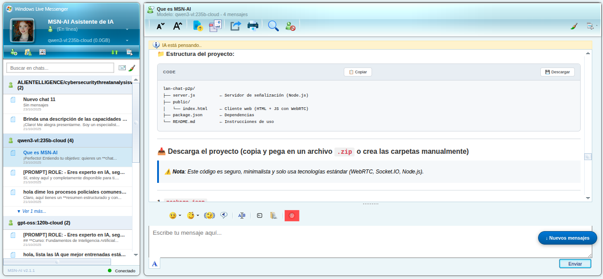

# 🚀 MSN-AI - Windows Live Messenger con IA Local


> *Donde la nostalgia se encuentra con la inteligencia artificial moderna*

**Versión 2.1.1** | **Licencia GPL-3.0** | **Por Alan Mac-Arthur García Díaz**

<p align="center">
  
</p>

---

## 📋 Tabla de Contenidos

- [🎯 ¿Qué es MSN-AI?](#-qué-es-msn-ai)
- [✨ Características Principales](#-características-principales)
- [🚀 Inicio Rápido](#-inicio-rápido)
- [📋 Requisitos del Sistema](#-requisitos-del-sistema)
- [🌍 Instalación por Plataforma](#-instalación-por-plataforma)
- [🎮 Guía de Uso](#-guía-de-uso)
- [⚙️ Configuración](#️-configuración)
- [🏗️ Arquitectura del Proyecto](#️-arquitectura-del-proyecto)
- [📊 Métricas del Proyecto](#-métricas-del-proyecto)
- [🤝 Contribuir](#-contribuir)
- [📞 Contacto y Soporte](#-contacto-y-soporte)
- [⚖️ Licencia](#️-licencia)
- [📅 Historial de Cambios](#-historial-de-cambios)

---

## 🎯 ¿Qué es MSN-AI?

MSN-AI es una aplicación web que combina la interfaz nostálgica de **Windows Live Messenger 8.5** con modelos de **IA local y en Nube** ejecutados a través de Ollama.

**Dos ediciones disponibles:**

| **🐳 Docker Edition** | **💻 Local Edition** |
|----------------------|---------------------|
| Instalación de 1 comando | Instalación tradicional |
| Cero configuración manual | Máximo control |
| Compatible universal | Rendimiento nativo |
| Ideal para nuevos usuarios | Ideal para desarrolladores |

---

## ✨ Características Principales

### 🎨 Interfaz y Experiencia
- **Interfaz auténtica** de Windows Live Messenger 8.5
- **5 sonidos originales** (login.wav, logout.wav, message_in.wav, message_out.wav, nudge.wav)
- **Estados de presencia** - Online 🟢, Away 🟡, Busy 🔴, Invisible ⚪
- **Emoticones integrados** - 30 emojis en 2 categorías (Naturales y Amor)
- **Animaciones MSN** - Efectos visuales auténticos

### 🤖 Inteligencia Artificial
- **IA local integrada** - Compatible con todos los modelos de Ollama (Mistral, Llama, Phi3, Qwen, etc.)
- **Detección automática de modelos** - Carga modelos disponibles dinámicamente
- **Multi-chat simultáneo** - La IA responde en varios chats mientras navegas
- **Detener respuesta** - Aborta generación de IA en curso
- **Notificación de estado a IA** - La IA sabe cuando cambias tu estado (opcional)

### 💬 Gestión de Chats
- **Persistencia automática** - localStorage del navegador
- **Búsqueda avanzada** - En todos los chats o dentro de uno específico con resaltado
- **Ordenar historial** - Por fecha ascendente/descendente
- **Indicadores de no leídos** - Resalta chats nuevos en verde
- **Limpiar chat** - Borra mensajes sin eliminar el chat
- **Cerrar chat** - Cierra vista sin eliminar (con confirmación)
- **Eliminar chat** - Elimina permanentemente (con modal de confirmación)
- **Imprimir chat** - Versión imprimible con estilos

### 📝 Edición de Texto
- **Ajuste de tamaño** - 10px a 32px con botones ±
- **Formato de texto** - Negrita, cursiva, subrayado
- **Dictado por voz** 🎤 - Web Speech API
- **Subir archivos** - Archivos .txt directamente al chat
- **Zumbido/Nudge** 📳 - Como MSN original

### 📤 Import/Export
- **Exportar todos** - JSON completo con configuración
- **Exportar seleccionados** - Con checkboxes
- **Exportar chat actual** - Conversación individual
- **Importación inteligente** - Resolución automática de conflictos (Unir/Reemplazar/Omitir)

### 🌍 Sistema Multiidioma (22 idiomas)
🇪🇸 Español | 🇬🇧 Inglés | 🇩🇪 Alemán | 🇫🇷 Francés | 🇸🇦 Árabe | 🇨🇳 Chino | 🇮🇳 Hindi | 🇧🇩 Bengalí | 🇵🇹 Portugués | 🇷🇺 Ruso | 🇯🇵 Japonés | 🇰🇷 Coreano | 🇮🇩 Indonesio | 🇹🇷 Turco | 🇵🇰 Urdu | 🇻🇳 Vietnamita | 🇮🇳 Tamil | 🇮🇳 Telugu | 🇮🇳 Maratí | 🇮🇳 Panyabí | 🇵🇪 Quechua | 🇧🇴 Aymara

- **Detección automática** del idioma del navegador
- **Cambio manual** desde configuración
- **Persistencia** entre sesiones

### 🐳 Docker Edition v2.1.0
- **Instalación simplificada** - Un comando
- **Scripts de gestión** - docker-start.sh, docker-stop.sh, docker-status.sh, docker-logs.sh, docker-cleanup.sh, docker-check-config.sh, docker-test-ai.sh
- **Health checks automáticos**
- **Volúmenes persistentes**
- **Opción Nuclear** - Reset completo MSN-AI (solo recursos MSN-AI)

### 💻 Local Edition
- **Rendimiento nativo**
- **Scripts automáticos** - Linux, Windows, macOS
- **Detector de hardware** - Recomienda modelos según tu sistema
- **Accesos directos** - Lanzadores en escritorio

---

## 🚀 Inicio Rápido

### 🐳 Docker Edition (Recomendado)

```bash
# Linux / macOS
git clone https://github.com/mac100185/MSN-AI.git && cd MSN-AI && chmod +x *.sh && ./start-msnai-docker.sh --auto

# Windows (PowerShell)
git clone https://github.com/mac100185/MSN-AI.git; cd MSN-AI; .\start-msnai-docker.ps1 --auto
```

**Scripts de gestión:**
```bash
./docker-start.sh              # Iniciar
./docker-status.sh             # Estado
./docker-logs.sh --follow      # Logs en tiempo real
./docker-stop.sh               # Detener
./docker-cleanup.sh --nuclear  # Reset MSN-AI
```

**Acceso:**
- Local: `http://localhost:8000/msn-ai.html`
- Remoto: `http://[IP-SERVIDOR]:8000/msn-ai.html`

### 💻 Local Edition

#### 🐧 Linux
```bash
git clone https://github.com/mac100185/MSN-AI.git && cd MSN-AI
chmod +x *.sh
./ai_check_all.sh              # Detecta hardware y recomienda modelos
./start-msnai.sh --auto
./create-desktop-shortcut.sh   # Crear lanzador en escritorio
```

#### 🪟 Windows
```powershell
git clone https://github.com/mac100185/MSN-AI.git
cd MSN-AI
Set-ExecutionPolicy -ExecutionPolicy RemoteSigned -Scope CurrentUser
Unblock-File -Path .\start-msnai.ps1
Unblock-File -Path .\ai_check_all.ps1
Unblock-File -Path .\create-desktop-shortcut.ps1
.\ai_check_all.ps1             # Detecta hardware y recomienda modelos
.\start-msnai.ps1 --auto
.\create-desktop-shortcut.ps1  # Crear acceso directo en escritorio
```

#### 🍎 macOS
```bash
git clone https://github.com/mac100185/MSN-AI.git && cd MSN-AI
chmod +x *.sh
./ai_check_all_mac.sh          # Detecta hardware y recomienda modelos
./start-msnai-mac.sh --auto
./create-desktop-shortcut-mac.sh  # Crear MSN-AI.app en escritorio
```

### ⏹️ Detener Correctamente

**Docker:**
```bash
./docker-stop.sh
# O: docker-compose -f docker/docker-compose.yml down
```

**Local:**
```bash
Ctrl + C  # En la terminal donde se ejecutó
```

**Emergencia Docker:**
```bash
./docker-cleanup.sh --nuclear  # Reset completo MSN-AI
```

**Emergencia Local:**
```bash
# Linux/macOS
pkill -f "start-msnai"
pkill -f "python.*http.server"

# Windows
Get-Process -Name "python" | Where-Object {$_.CommandLine -like "*http.server*"} | Stop-Process
```

---

## 📋 Requisitos del Sistema

### 🐳 Docker Edition
- **Docker Engine** 20.10+ o Docker Desktop
- **SO**: Linux (Ubuntu 18.04+, Debian 10+), Windows 10/11, macOS 10.14+
- **RAM**: 2GB+ (16GB recomendado)
- **Disco**: 2GB+ libre
- **GPU**: NVIDIA (opcional)

### 💻 Local Edition

**Linux:**
- Ubuntu 18.04+, Debian 10+, Fedora 32+
- Python 3.6+
- Ollama instalado

**Windows:**
- Windows 10/11 (64-bit)
- PowerShell 5.1+
- Python 3.6+ (opcional)
- Ollama instalado

**macOS:**
- macOS 10.14+ (Mojave)
- Python 3.6+ (incluido)
- Ollama instalado

### 🌐 Común
- **Navegador**: Chrome 80+, Firefox 75+, Safari 14+, Edge 80+
- **JavaScript** habilitado
- **localStorage** disponible

### 🤖 Modelos Recomendados

**GPU (4GB+ VRAM):**
- `mistral:7b` (equilibrado)
- `llama3.2:latest`
- `qwen2.5:7b`
- `qwen3-vl:235b-cloud`
- `gpt-oss:120b-cloud`
- `qwen3-coder:480b-cloud`

**CPU + GPU NVIDIA (8GB+ RAM):**
- `phi3:mini`
- `gemma2:2b`
- `tinyllama`
- `qwen2.5:7b`
- `qwen3-vl:235b-cloud`
- `gpt-oss:120b-cloud`
- `qwen3-coder:480b-cloud`
- `Cualquier modelo disponible en https://ollama.com/search`

**Apple Silicon (M1/M2/M3):**
- `llama3.2:latest`
- `mistral:7b`
- `qwen2.5:7b`
- `qwen2.5:7b`
- `qwen3-vl:235b-cloud`
- `gpt-oss:120b-cloud`
- `qwen3-coder:480b-cloud`
- `Cualquier modelo disponible en https://ollama.com/search`

---

## 🌍 Instalación por Plataforma

### 🐳 Docker Linux

```bash
git clone https://github.com/mac100185/MSN-AI.git
cd MSN-AI
chmod +x start-msnai-docker.sh
./start-msnai-docker.sh --auto
```

**GPU NVIDIA: Opcional**
```bash
sudo apt-get install -y nvidia-container-toolkit
sudo systemctl restart docker
docker-compose -f docker/docker-compose.yml --profile gpu up -d
```

### 🐳 Docker Windows

```powershell
git clone https://github.com/mac100185/MSN-AI.git
cd MSN-AI
Set-ExecutionPolicy -ExecutionPolicy RemoteSigned -Scope CurrentUser
Unblock-File -Path .\start-msnai-docker.ps1
.\start-msnai-docker.ps1 --auto
```

### 🐳 Docker macOS

```bash
git clone https://github.com/mac100185/MSN-AI.git
cd MSN-AI
chmod +x start-msnai-docker-mac.sh
./start-msnai-docker-mac.sh --auto
```

### 💻 Linux Local

```bash
# 1. Instalar dependencias
sudo apt update && sudo apt install -y python3 curl git  # Ubuntu/Debian
# sudo dnf install -y python3 curl git                   # Fedora/RHEL

# 2. Clonar y configurar
git clone https://github.com/mac100185/MSN-AI.git
cd MSN-AI
chmod +x *.sh

# 3. Detectar hardware y configurar IA
./ai_check_all.sh

# 4. Iniciar
./start-msnai.sh --auto

# 5. Crear lanzador en escritorio
./create-desktop-shortcut.sh
```

### 💻 Windows Local

```powershell
# 1. Clonar
git clone https://github.com/mac100185/MSN-AI.git
cd MSN-AI

# 2. Configurar PowerShell
Set-ExecutionPolicy -ExecutionPolicy RemoteSigned -Scope CurrentUser

# 3. Desbloquear scripts
Unblock-File -Path .\start-msnai.ps1
Unblock-File -Path .\ai_check_all.ps1
Unblock-File -Path .\create-desktop-shortcut.ps1

# 4. Detectar hardware
.\ai_check_all.ps1

# 5. Iniciar
.\start-msnai.ps1 --auto

# 6. Crear acceso directo
.\create-desktop-shortcut.ps1
```

### 💻 macOS Local

```bash
# 1. Clonar
git clone https://github.com/mac100185/MSN-AI.git
cd MSN-AI

# 2. Dar permisos
chmod +x *.sh

# 3. Detectar hardware
./ai_check_all_mac.sh

# 4. Iniciar
./start-msnai-mac.sh --auto

# 5. Crear aplicación en escritorio
./create-desktop-shortcut-mac.sh
```
---

## 🧠 Comandos de Ollama para gestionar modelos

### 📥 Descargar / Crear modelos
```bash
ollama pull <nombre-del-modelo>        # Descarga un modelo desde la biblioteca de Ollama
ollama create <nombre> -f <Modelfile>  # Crea un modelo personalizado a partir de un Modelfile
```

### ▶️ Ejecutar modelos
```bash
ollama run <nombre-del-modelo>         # Ejecuta un modelo en modo interactivo
ollama run <nombre> "tu prompt aquí"   # Ejecuta un modelo con un prompt específico
```

### 📋 Listar modelos
```bash
ollama list                            # Muestra todos los modelos descargados localmente
```

### 🗑️ Eliminar modelos
```bash
ollama rm <nombre-del-modelo>          # Elimina un modelo del sistema
```

### 🔄 Copiar modelos
```bash
ollama cp <origen> <destino>           # Copia un modelo con un nuevo nombre
```

### ℹ️ Información del modelo
```bash
ollama show <nombre-del-modelo>        # Muestra información detallada del modelo
ollama show --modelfile <nombre>       # Muestra el Modelfile usado para crear el modelo
ollama show --parameters <nombre>      # Muestra los parámetros del modelo
ollama show --license <nombre>         # Muestra la licencia del modelo
ollama show --template <nombre>        # Muestra la plantilla de prompt del modelo
```

### ⚙️ Gestión del servicio (solo relevante en algunos entornos)
```bash
ollama serve                           # Inicia el servidor de Ollama manualmente (generalmente no necesario)
```

---

## 🖥️ Notas por sistema operativo

| Sistema       | Instalación típica                              | Acceso al CLI                     | Notas                                                                 |
|---------------|--------------------------------------------------|-----------------------------------|-----------------------------------------------------------------------|
| **Linux**     | `curl -fsSL https://ollama.com/install.sh \| sh` | Disponible en `$PATH`             | Requiere `systemd` o inicio manual del daemon (`ollama serve`).      |
| **macOS**     | Descargar desde [ollama.com](https://ollama.com) | Disponible en terminal            | Se ejecuta como app en segundo plano; el CLI se integra automáticamente. |
| **Windows**   | Descargar desde [ollama.com](https://ollama.com) | Disponible en PowerShell o CMD    | Requiere Windows 10/11 (64-bit); se ejecuta como servicio en segundo plano. |

> 💡 **Importante**: En **Windows y macOS**, aunque Ollama se instala mediante un instalador gráfico, el comando `ollama` está disponible en la terminal (PowerShell/CMD en Windows, Terminal en macOS) una vez instalado y en ejecución.
---

## 🎮 Guía de Uso

### 🎭 Cambiar Estado
1. Clic en selector de estado (parte superior)
2. Selecciona: Online 🟢 | Away 🟡 | Busy 🔴 | Invisible ⚪
3. **Bonus**: Activa "Notificar cambios a IA" en configuración

### 💬 Gestión de Chats

**Crear chat:**
- Clic en botón **"+"**
- Empieza a conversar

**Buscar:**
- Barra superior: busca en todos los chats
- Botón lupa 🔍: busca en chat actual (resalta coincidencias)

**Ordenar:**
- Clic en botón de ordenar (lista de chats)
- Alterna ascendente/descendente

**Exportar:**
- Botón "Exportar": todos los chats
- Botón "Seleccionar": exportar solo algunos (con checkboxes)
- Menú chat (⋮) → "Exportar": chat individual

**Importar:**
- Botón "Importar" → Selecciona JSON
- Resolución automática de conflictos (Unir/Reemplazar/Omitir)

**Otras acciones:**
- Limpiar: borra mensajes, mantiene chat
- Cerrar: cierra vista (con confirmación)
- Eliminar: elimina permanentemente (con modal)
- Imprimir: genera versión imprimible

### 📝 Edición de Texto

**Escribir mensaje:**
- Escribe en área de texto
- Presiona **Enter** o clic "Enviar"
- Sonidos: envío 📤 y recepción 📥

**Ajustar tamaño:**
- Botones **A-** y **A+**
- Rango: 10px a 32px

**Emoticones:**
- Clic botón 😊
- Selecciona categoría (Naturales/Amor)
- 30 emojis disponibles

**Formato:**
- Negrita, cursiva, subrayado
- Selecciona texto y aplica formato

**Zumbido:**
- Clic botón 📳
- Envía "sacudida" como MSN original

**Dictado por voz:**
- Clic botón 🎤
- Permite permisos de micrófono
- Habla y transcribe automáticamente

**Subir archivo:**
- Clic botón 📄
- Selecciona archivo .txt
- Contenido se agrega al mensaje

### 🌍 Cambiar Idioma
1. Clic en configuración ⚙️
2. Selector de idioma
3. Selecciona de 22 idiomas disponibles
4. Interfaz se traduce instantáneamente

---

## ⚙️ Configuración

Accede desde botón **⚙️** en la interfaz:

- 🔊 **Sonidos** - Activar/desactivar efectos MSN
- 📢 **Notificar cambios de estado** - IA sabe tu estado
- 🌍 **Idioma** - 22 idiomas disponibles
- 🌐 **Servidor Ollama** - URL (autodetección o manual)
- 🤖 **Modelo de IA** - Selector dinámico
- ⏱️ **Timeout API** - Tiempo máximo de espera (30s por defecto)
- 🔌 **Probar conexión** - Verifica Ollama y modelos

**Persistencia:** Todas las configuraciones se guardan en localStorage.

---

## 🏗️ Arquitectura del Proyecto

```
MSN-AI/
├── msn-ai.html              # HTML (827 líneas)
├── msn-ai.js                # JavaScript (4,697 líneas)
├── styles.css               # CSS (1,666 líneas)
├── lang/                    # 22 archivos JSON de traducción
│   ├── es.json, en.json, de.json, fr.json
│   ├── ar.json, zh.json, hi.json, bn.json
│   ├── pt.json, ru.json, ja.json, ko.json
│   ├── id.json, tr.json, ur.json, vi.json
│   ├── ta.json, te.json, mr.json, pa.json
│   └── qu.json, ay.json
├── assets/
│   ├── sounds/              # 5 archivos WAV
│   │   ├── login.wav, logout.wav
│   │   ├── message_in.wav, message_out.wav
│   │   └── nudge.wav
│   ├── background/, chat-window/, contacts-window/
│   ├── general/, scrollbar/, status/
│   └── screenshots/
├── docker/
│   ├── Dockerfile
│   ├── docker-compose.yml
│   ├── docker-entrypoint.sh
│   ├── healthcheck.sh
│   └── scripts/
├── Docker Edition:
│   ├── start-msnai-docker.sh (Linux)
│   ├── start-msnai-docker.ps1 (Windows)
│   ├── start-msnai-docker-mac.sh (macOS)
│   ├── docker-start.sh, docker-stop.sh
│   ├── docker-status.sh, docker-logs.sh
│   ├── docker-cleanup.sh, docker-check-config.sh
│   └── docker-test-ai.sh
├── Local Edition:
│   ├── start-msnai.sh (Linux)
│   ├── start-msnai.ps1 (Windows)
│   ├── start-msnai-mac.sh (macOS)
│   ├── ai_check_all.sh (Linux)
│   ├── ai_check_all.ps1 (Windows)
│   ├── ai_check_all_mac.sh (macOS)
│   ├── create-desktop-shortcut.sh (Linux)
│   ├── create-desktop-shortcut.ps1 (Windows)
│   ├── create-desktop-shortcut-mac.sh (macOS)
│   └── test-msnai.sh
└── LICENSE
```

### 📱 Frontend (msn-ai.js)

**Clase Principal: MSNAI**
```javascript
class MSNAI {
  constructor() {
    this.chats = [];
    this.currentChatId = null;
    this.isConnected = false;
    this.availableModels = [];
    this.sounds = {};
    this.fontSize = 14;
    this.chatSortOrder = "asc";
    this.pendingFileAttachment = null;
    this.abortControllers = {};
    this.availableLanguages = [];
    this.currentLanguage = "es";
    this.translations = {};
    this.settings = {
      soundsEnabled: true,
      ollamaServer: "http://localhost:11434",
      selectedModel: "",
      apiTimeout: 30000,
      notifyStatusChanges: false,
      language: "es"
    };
  }

  // 45+ métodos implementados
  async loadLanguages()
  async setLanguage(langCode)
  async connectToOllama()
  async sendMessage()
  async sendToAI(message, chatId, onToken)
  async notifyStatusChangeToAI(newStatus, oldStatus)
  async sendNudge()
  saveToLocalStorage()
  exportChats()
  exportSelectedChats()
  exportSingleChat(chatId)
  async processImportedChats(importedChats)
  async showImportConflictModal(conflicts)
  searchInCurrentChat(query)
  sortChatHistory()
  printCurrentChat()
  clearCurrentChat()
  closeCurrentChat()
  deleteChat(chatId)
  stopAIResponse()
  startVoiceInput()
  uploadTextFile()
  async checkConnection()
  async updateAvailableModels()
  setupEventListeners()
  async init()
  // ... y más
}
```

### 💾 Almacenamiento (localStorage)

```javascript
{
  "version": "1.0",
  "exportDate": "2025-01-XX...",
  "chats": [
    {
      "id": "chat-...",
      "title": "Título del chat",
      "date": "2025-01-XX...",
      "model": "mistral:7b",
      "messages": [
        { "type": "user", "content": "...", "timestamp": "..." },
        { "type": "ai", "content": "...", "timestamp": "..." }
      ]
    }
  ],
  "settings": {
    "soundsEnabled": true,
    "ollamaServer": "http://localhost:11434",
    "selectedModel": "mistral:7b",
    "apiTimeout": 30000,
    "notifyStatusChanges": false,
    "language": "es"
  }
}
```

### 🌍 Sistema de Traducción

- 22 archivos JSON en `lang/`
- Detección automática del idioma del navegador
- Carga bajo demanda (lazy loading)
- Fallback a inglés si falla
- Estructura consistente en todos los idiomas

---

## 📊 Métricas del Proyecto

### 📏 Código
- **HTML**: 827 líneas
- **JavaScript**: 4,697 líneas
- **CSS**: 1,666 líneas
- **Total**: 7,190 líneas

### 🎯 Funcionalidades
- **45+ métodos** en clase MSNAI
- **22 idiomas** soportados
- **5 sonidos** auténticos MSN
- **30 emoticones** (2 categorías)
- **4 estados** de presencia
- **3 modos** de exportación
- **7 scripts** Docker de gestión
- **9 scripts** de instalación local

### 🌐 Compatibilidad
- **3 sistemas operativos**: Linux, Windows, macOS
- **4 navegadores**: Chrome, Firefox, Safari, Edge
- **2 ediciones**: Docker y Local
- **Todos los modelos** de Ollama

---

## 🤝 Contribuir

1. **Fork** el repositorio
2. **Crea** una rama: `git checkout -b feature/nueva-funcionalidad`
3. **Desarrolla** siguiendo convenciones del proyecto
4. **Commit**: `git commit -m 'Añade nueva funcionalidad'`
5. **Push**: `git push origin feature/nueva-funcionalidad`
6. **Pull Request** con descripción detallada

### 🐛 Reportar Bugs
- **GitHub Issues**: https://github.com/mac100185/MSN-AI/issues
- Incluye: SO, navegador, pasos para reproducir, logs

### 💡 Sugerir Features
- **GitHub Discussions**: https://github.com/mac100185/MSN-AI/discussions
- Describe el problema que resuelve
- Mockups/ejemplos si es posible

---

## 📞 Contacto y Soporte

**Desarrollador**: Alan Mac-Arthur García Díaz
**Email**: alan.mac.arthur.garcia.diaz@gmail.com
**Repositorio**: https://github.com/mac100185/MSN-AI

### 🆘 Obtener Ayuda
- **Issues**: Para bugs y problemas técnicos
- **Discussions**: Para preguntas y sugerencias
- **Email**: Para soporte directo

---

## ⚖️ Licencia

Este proyecto está licenciado bajo **GNU General Public License v3.0**.

### 🔑 GPL-3.0 en resumen:
- ✅ Libertad de usar para cualquier propósito
- ✅ Libertad de estudiar (código fuente disponible)
- ✅ Libertad de modificar y adaptar
- ✅ Libertad de distribuir
- ⚖️ Copyleft: modificaciones deben ser GPL-3.0

Ver [LICENSE](LICENSE) para texto completo.

### 🤝 Créditos
- **[androidWG/WLMOnline](https://github.com/androidWG/WLMOnline)** - Proyecto base para interfaz
- **Microsoft Corporation** - Windows Live Messenger original (Fair Use educativo)
- **[Ollama](https://ollama.ai)** - IA local accesible
- **Proyecto Escargot** - Preservación del espíritu MSN

### 📜 Derechos de Terceros
- Assets de Microsoft: Fair Use para preservación histórica
- Sonidos originales: Fines educativos
- Marcas registradas de respectivos propietarios

---

## 📅 Historial de Cambios

### [2.1.0] - 2025-01-19

**✨ Añadido:**
- 🎭 Estados de presencia (Online, Away, Busy, Invisible)
- 📢 Notificación de estado a IA (opcional)
- 📝 Ajuste de tamaño de fuente (10px-32px)
- 😊 Emoticones integrados (30 emojis, 2 categorías)
- 🎤 Dictado por voz (Web Speech API)
- 📄 Subir archivos de texto
- 📳 Zumbido/Nudge manual
- 🔍 Búsqueda avanzada (todos los chats y en chat específico)
- 📊 Ordenar historial (ascendente/descendente)
- 📤 Exportación flexible (todos, seleccionados, individual)
- 🔄 Importación inteligente (resolución de conflictos)
- 🖨️ Imprimir chat
- 🧹 Limpiar y cerrar chats
- 💬 Multi-chat simultáneo
- 📩 Indicadores de no leídos
- 🛑 Detener respuesta de IA
- 🌍 Sistema multiidioma (22 idiomas)
- 🐳 Docker Edition v2.1.0
- 🆕 Scripts Docker dedicados (7 scripts)
- 🔥 Opción Nuclear MSN-AI

**🔧 Mejorado:**
- Interface modularizada (HTML + JS + CSS)
- Auto-detección de IP y modelos
- Zero-config para Docker
- Logs detallados
- Manejo robusto de errores

**🐛 Corregido:**
- Detección de modelos Ollama
- Indicador de conexión
- Healthcheck circular dependency
- docker-compose warnings
- Encoding de archivos de idioma

### [1.0.0] - 2025-01-15

**🎉 Versión Inicial:**
- Interfaz auténtica MSN 8.5
- Integración con Ollama
- Persistencia de chats
- Sonidos originales MSN
- Import/Export básico
- Scripts de instalación local

---

**MSN-AI v2.1.0** - *Donde el pasado conversa con el futuro*

**Desarrollado con ❤️ por Alan Mac-Arthur García Díaz**
**Licenciado bajo GPL-3.0 | Enero 2025**

⭐ **Si te gusta el proyecto, deja una estrella en GitHub!**
